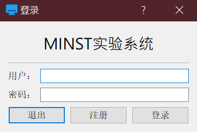
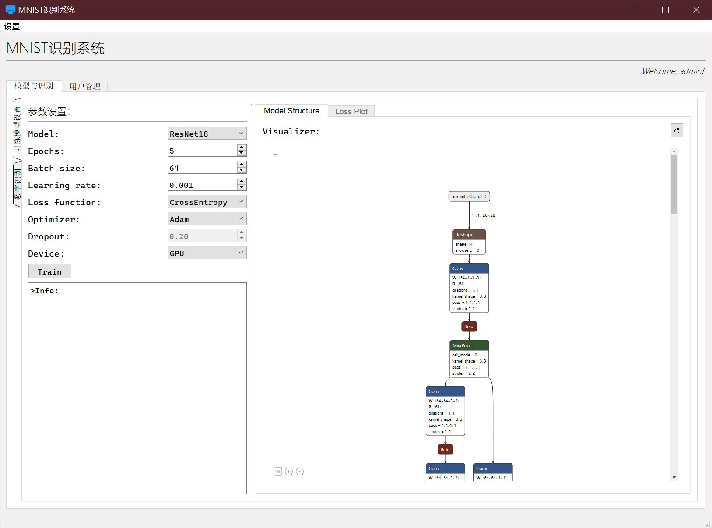
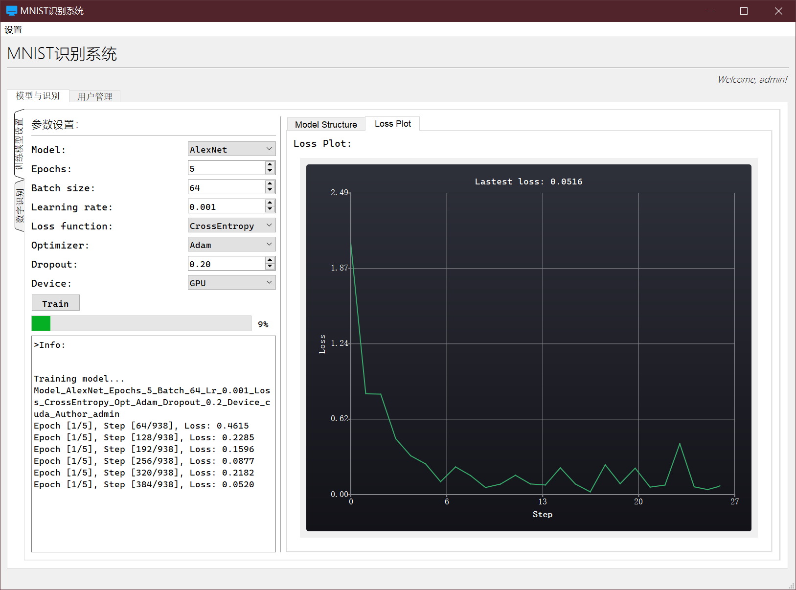
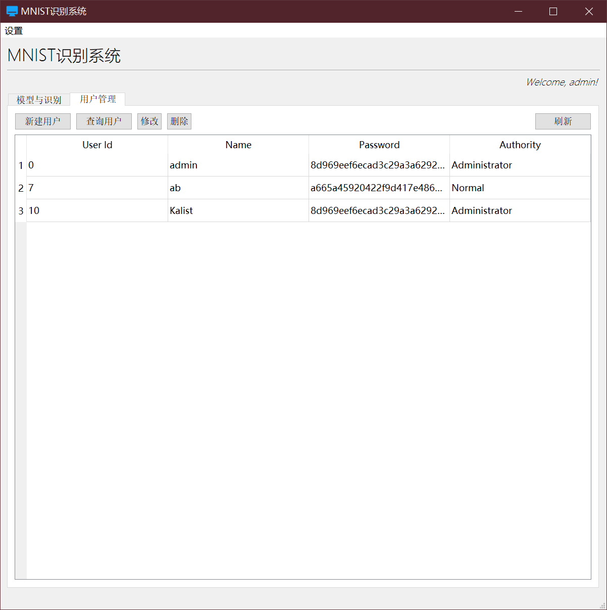
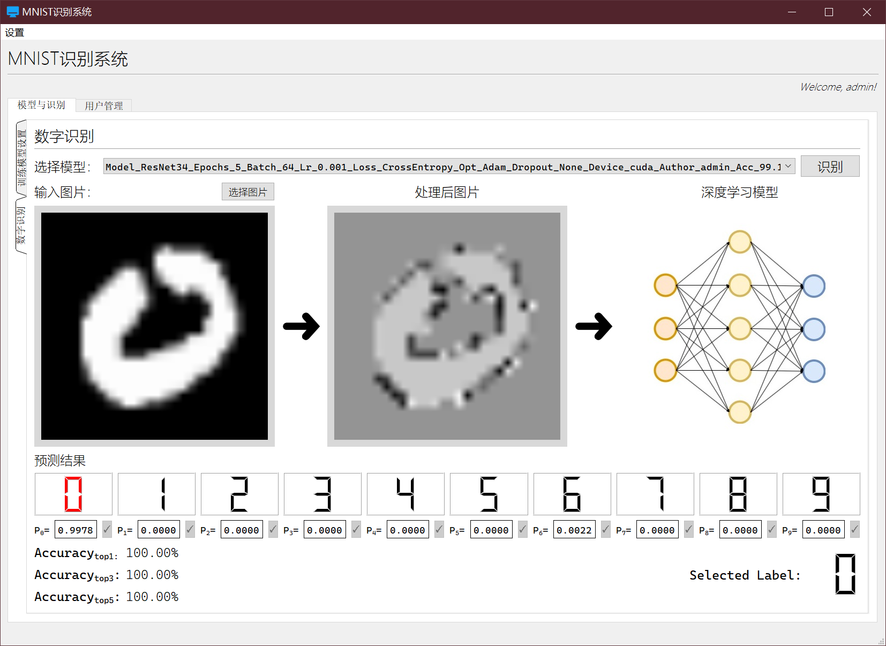

# MNIST System

## Description/软件描述
An assignment for my school coures software engineering.

This is a simple system that allows users to upload a digital picture and then classify it using a neural network. 
The system is built using Python and PyQt5. 
The neural network is built using PyTorch and is trained on the MNIST dataset.

Training hyperparameters and models are customizable.
Currently, the models provided are MLP, AlexNet, ResNet, and ViT.

Using netron to visualize the model.
But ViT is currently not supported for visualization.
(Tranformer_encoder layer cannot be exported using ```torch.onnx.export``` directly)

Database is used only to store the user's information.

Users can set their own username and password.

一个学校课程软件工程的实验作业。
使用PyQt5构建的一个简单的系统，允许用户上传一个数字图片，然后使用神经网络对其进行分类。
神经网络使用PyTorch构建，并在MNIST数据集上进行训练。

训练超参数与模型是可以自定义的。
模型目前提供了MLP,AlexNet,ResNet和ViT四种模型。

使用netron来可视化模型。
但是ViT目前不支持可视化。(Tranformer_encoder层无法使用```torch.onnx.export```直接导出)

而数据库仅用于存储用户的信息。(实验任务要求)

用户可以设置自己的用户名和密码

## Environment/环境

- Python3.11.5
- PyQt5
- PyQt5_sip
- mysql_connector
- netron
- numpy
- onnxruntime
- Pillow9.3.0
- torch
- torchvision

Tips:
Higher version of Pillow may not support the image convert for PyQt5

## Installation/安装

Install the required packages by running the following command:

```bash
pip install -r requirements.txt
```
## Run

```Activate the software
python python main.py 
        --host {your_db_host} 
        --user {your_db_user} 
        --password {your_db_password} 
        --database {your_db_name} 
        --login_without_info {True/False}
```

## Software Snapshots/截图
Login Dialog:

<p align="center">
  
</p>

System MainWindow:




